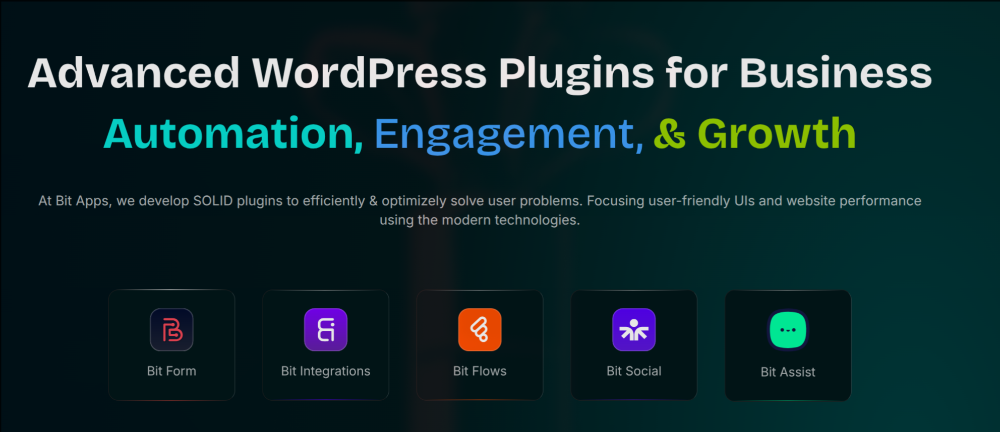

<!--
Title: Bit Apps - Advanced WordPress Plugins for Automation and Growth
Description: Bit Apps develops premium WordPress plugins including Bit Form, Bit Integrations, Bit Social, Bit Assist, and Bit Flows for business automation, engagement, and growth.
Author: Bit-Apps-Pro
Keywords: wordpress, plugins, automation, forms, integrations, social media, automation, bit apps, bit form, bit integrations
-->

  
# Bit Apps · Advanced WordPress Plugins 

**Powerful WordPress Solutions for Business Automation, Engagement & Growth**

## ✨ About Bit Apps

At **Bit Apps**, we develop **high-quality WordPress plugins** to efficiently solve complex business problems while focusing on user-friendly interfaces and optimal website performance. Our solutions help businesses worldwide automate processes, enhance engagement, and drive growth through powerful yet accessible tools.

> 🚀 **Trusted by thousands** of users with over **500,000+ downloads** and **1,500+ five-star reviews**

## 🛠️ Our Products

Bit Apps offers a suite of powerful WordPress plugins designed to work seamlessly together:

| Product | Description | Key Features |
|---------|-------------|-------------|
| **[Bit Form](https://bit-form.com/)** | Advanced Drag & Drop Form Builder Plugin for WordPress | 🎯 Drag-and-Drop Interface 🔄 Conditional Logic 📊 50+ Integrations 🎨 Customizable Styles |
| **[Bit Integrations](https://bit-integrations.com/)** | WordPress Automation and Integration Plugin | ⚡ 290+ Platform Integrations 🔌 Webhooks & Custom API 🤖 No-Code Automation 📈 Real-time Data Sync |
| **[Bit Social](https://bit-social.com/)** | Social Media Automation Plugin for WordPress | 📱 Multi-Platform Posting ⏰ Scheduled Publishing 📊 Performance Analytics 🔗 Cross-Platform Sharing |
| **[Bit Assist](https://bitapps.pro/bit-assist/)** | WordPress Live Chat & Support Widget | 🔗 30+ Channel Integration   🎨 Fully Customizable Widget   🛒 WooCommerce Integration  🌐 External Website Support  📊 Built-in Analytics  ⏰ Business Hours Setting|
| **[Bit Flows](https://bit-flows.com/)** | Advance AI Workflow Automation Plugin for WordPress | 🔄 Visual Workflow Builder ⚙️ Custom Triggers & Actions 🔄 Delay, Schedule, Router, Parsers and more 📈 AI Automation |

## 🌟 Why Choose Bit Apps?

- **14-Day Refund Policy**: Risk-free trial for all products
- **Regular Updates**: Continuous feature enhancements and compatibility improvements
- **Robust Free & Pro Versions**: Powerful functionality at affordable prices
- **Highly Rated Support**: Dedicated team ensuring smooth user experience
- **Enterprise-Grade Security**: Strict security protocols to protect your data
- **Standardized Code**: Clean, efficient, and reliable codebase for optimal performance

## 📞 Get In Touch

- **🌐 Website**: [https://bitapps.pro](https://bitapps.pro)
- **📧 Support**: [Support Portal](https://bitapps.pro/contact/)
- **🎥 Tutorials**: [Video Guides](https://www.youtube.com/@bit-apps/playlists)
- **👥 Community**: [Facebook Group](https://www.facebook.com/groups/bitapps)

---

  
### **✨ Transform Your WordPress Experience with Bit Apps Today!**

[Explore Our Plugins](https://bitapps.pro/plugin-hub/){ .md-button .md-button--primary } [View Demos](https://towp.io/){ .md-button }

*Copyright © 2025 Bit Apps. All rights reserved.*

